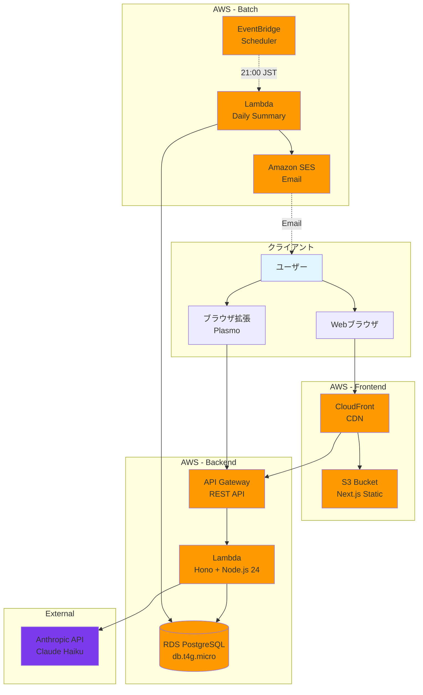
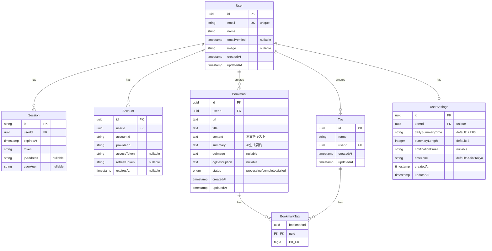
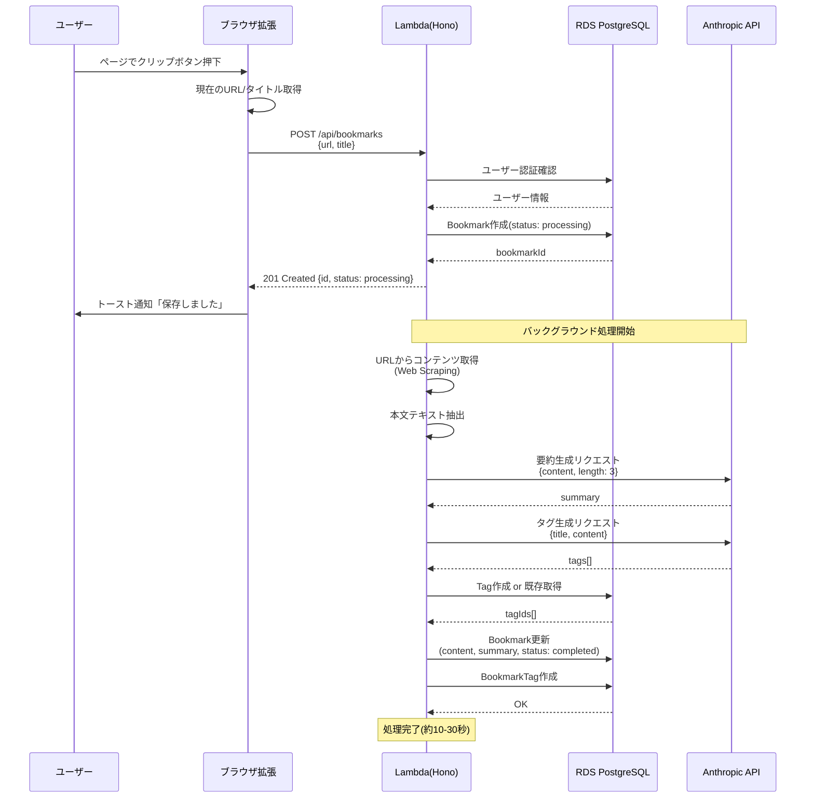
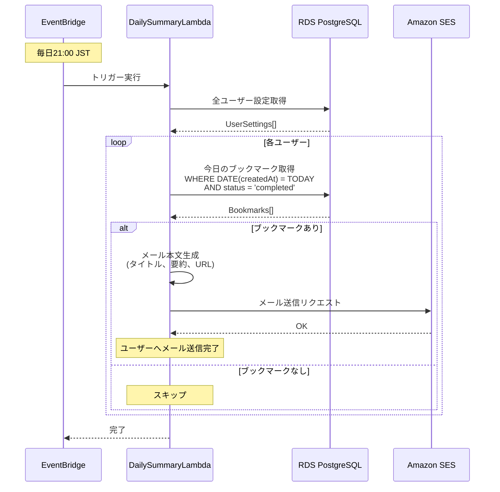
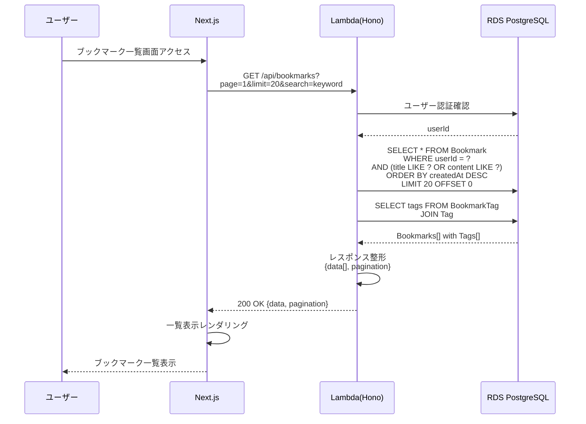
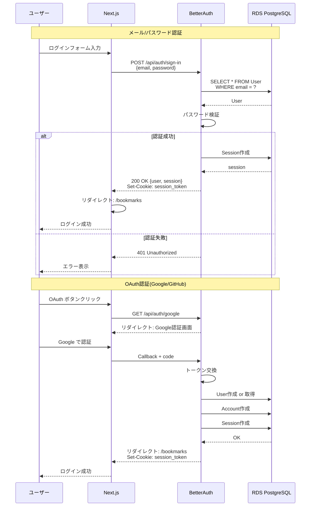

# 設計書

**アプリケーション名:** Remindrop

> **📝 このドキュメントの更新タイミング**
> - データベーススキーマを変更したとき
> - 新しいAPIエンドポイントを追加/変更したとき
> - システムアーキテクチャを変更したとき
> - 技術スタックを変更したとき

## 1. システムアーキテクチャ

### 1.1 全体構成図



### 1.2 技術スタック

#### フロントエンド
| 技術 | バージョン | 用途 |
|------|----------|------|
| Next.js | 15 | Webアプリケーションフレームワーク |
| React | 19 | UIライブラリ |
| TypeScript | 5.x | 型安全な開発 |
| TailwindCSS | 4.x | スタイリング（@tailwindcss/postcss） |
| shadcn/ui | Latest | UIコンポーネントライブラリ |
| React Query | 5.x | サーバー状態管理・データフェッチング |
| React Query Devtools | 5.x | 開発時のクエリ状態可視化 |
| Orval | 7.x | OpenAPIから型安全なAPIクライアント生成 |
| Zustand | 4.x | クライアント状態管理(軽量・オプション) |
| next-themes | Latest | ダークモード対応 |

#### バックエンド
| 技術 | バージョン | 用途 |
|------|----------|------|
| Hono | 4.x | 軽量Webフレームワーク |
| @hono/zod-openapi | Latest | OpenAPI生成・バリデーション |
| AWS Lambda | - | サーバーレス実行環境 |
| Node.js | 24 | ランタイム |
| TypeScript | 5.x | 型安全な開発 |
| Drizzle ORM | Latest | データベースORM |
| BetterAuth | Latest | 認証ライブラリ |

#### データベース
| 技術 | 仕様 | 用途 |
|------|------|------|
| RDS PostgreSQL | db.t4g.micro | リレーショナルデータベース |

#### ブラウザ拡張
| 技術 | バージョン | 用途 |
|------|----------|------|
| Plasmo | Latest | ブラウザ拡張フレームワーク |
| TypeScript | 5.x | 型安全な開発 |

#### インフラ・その他
| 技術 | 用途 |
|------|------|
| AWS CDK | Infrastructure as Code |
| CloudFront | CDN |
| S3 | 静的ファイルホスティング |
| API Gateway | REST APIエンドポイント |
| EventBridge | スケジュール実行 |
| SES | メール送信 |
| CloudWatch | ログ・モニタリング |
| ACM | SSL/TLS証明書管理 |
| Anthropic API | LLM(要約・タグ生成) |

---

## 2. データベース設計

### 2.1 ER図



### 2.2 テーブル定義

#### User (ユーザー)

```typescript
{
  id: uuid (PK)
  email: string (unique, not null)
  name: string (not null)
  emailVerified: timestamp (nullable)
  image: string (nullable)
  createdAt: timestamp (not null, default: now())
  updatedAt: timestamp (not null, default: now())
}
```

**インデックス**
- PRIMARY KEY: id
- UNIQUE: email

**説明**
- ユーザーアカウント情報を管理
- BetterAuthと連携

---

#### Session (セッション)

```typescript
{
  id: string (PK)
  userId: uuid (FK: User.id, not null)
  expiresAt: timestamp (not null)
  token: string (not null)
  ipAddress: string (nullable)
  userAgent: string (nullable)
}
```

**インデックス**
- PRIMARY KEY: id
- INDEX: userId
- INDEX: token

**説明**
- ユーザーセッション管理
- BetterAuthが自動管理

---

#### Account (外部認証アカウント)

```typescript
{
  id: uuid (PK)
  userId: uuid (FK: User.id, not null)
  accountId: string (not null)
  providerId: string (not null)
  accessToken: string (nullable)
  refreshToken: string (nullable)
  expiresAt: timestamp (nullable)
}
```

**インデックス**
- PRIMARY KEY: id
- INDEX: userId
- UNIQUE: (providerId, accountId)

**説明**
- OAuth連携情報(Google、GitHub)
- BetterAuthが自動管理

---

#### Bookmark (ブックマーク)

```typescript
{
  id: uuid (PK)
  userId: uuid (FK: User.id, not null)
  url: text (not null)
  title: text (not null)
  content: text (nullable) // 本文テキスト
  summary: text (nullable) // AI生成要約
  ogImage: text (nullable)
  ogDescription: text (nullable)
  status: enum ('processing', 'completed', 'failed') (not null, default: 'processing')
  createdAt: timestamp (not null, default: now())
  updatedAt: timestamp (not null, default: now())
}
```

**インデックス**
- PRIMARY KEY: id
- INDEX: userId
- INDEX: (userId, createdAt DESC) // 一覧取得用
- INDEX: status
- FULL TEXT INDEX: (title, content, summary) // 全文検索用

**説明**
- ブックマークの本体
- statusで処理状態を管理(processing → completed/failed)

---

#### Tag (タグ)

```typescript
{
  id: uuid (PK)
  name: string (not null)
  userId: uuid (FK: User.id, not null)
  createdAt: timestamp (not null, default: now())
  updatedAt: timestamp (not null, default: now())
}
```

**インデックス**
- PRIMARY KEY: id
- INDEX: userId
- UNIQUE: (userId, name)

**説明**
- ユーザーごとのタグマスター
- 同じユーザー内でタグ名は一意

---

#### BookmarkTag (ブックマーク-タグ中間テーブル)

```typescript
{
  bookmarkId: uuid (PK, FK: Bookmark.id, not null)
  tagId: uuid (PK, FK: Tag.id, not null)
}
```

**インデックス**
- PRIMARY KEY: (bookmarkId, tagId)
- INDEX: bookmarkId
- INDEX: tagId

**説明**
- ブックマークとタグの多対多関係

---

#### UserSettings (ユーザー設定)

```typescript
{
  id: uuid (PK)
  userId: uuid (FK: User.id, unique, not null)
  dailySummaryTime: string (not null, default: '21:00') // HH:MM形式
  summaryLength: integer (not null, default: 3) // 要約の行数
  notificationEmail: string (nullable) // 未設定ならUser.emailを使用
  timezone: string (not null, default: 'Asia/Tokyo')
  createdAt: timestamp (not null, default: now())
  updatedAt: timestamp (not null, default: now())
}
```

**インデックス**
- PRIMARY KEY: id
- UNIQUE: userId

**説明**
- ユーザーごとの設定
- ユーザー登録時に自動作成(デフォルト値)

---

## 3. API設計

### 3.0 OpenAPI仕様

**HonoのOpenAPI対応**

`@hono/zod-openapi`を使用して、型安全なAPIとOpenAPI仕様書の自動生成を実現。

**メリット:**
- Zodスキーマからバリデーションとドキュメントを自動生成
- 型安全性の向上
- Swagger UIでのAPIドキュメント提供
- フロントエンドとの型共有

**実装例:**
```typescript
import { createRoute, OpenAPIHono, z } from '@hono/zod-openapi'

// スキーマ定義
const BookmarkSchema = z.object({
  id: z.uuid(),
  url: z.url(),
  title: z.string(),
  createdAt: z.iso.datetime(),
})

// ルート定義
const createBookmarkRoute = createRoute({
  method: 'post',
  path: '/api/bookmarks',
  request: {
    body: {
      content: {
        'application/json': {
          schema: z.object({
            url: z.url(),
            title: z.string().optional(),
          }),
        },
      },
    },
  },
  responses: {
    201: {
      content: {
        'application/json': {
          schema: BookmarkSchema,
        },
      },
      description: 'Bookmark created successfully',
    },
    400: {
      content: {
        'application/json': {
          schema: z.object({
            error: z.string(),
          }),
        },
      },
      description: 'Invalid request',
    },
  },
})

// アプリケーション
const app = new OpenAPIHono()

app.openapi(createBookmarkRoute, async (c) => {
  const { url, title } = c.req.valid('json')
  // ... 実装
  return c.json(bookmark, 201)
})

// OpenAPI仕様書の提供
app.doc('/api/openapi.json', {
  openapi: '3.0.0',
  info: {
    version: '1.0.0',
    title: 'Remindrop API',
  },
})

// Swagger UI
app.get('/api/docs', swaggerUI({ url: '/api/openapi.json' }))
```

**OpenAPI仕様書のエンドポイント:**
- `GET /api/openapi.json` - OpenAPI 3.0仕様書（JSON）
- `GET /api/docs` - Swagger UI

---

### 3.1 認証API (BetterAuth)

#### サインアップ
```
POST /api/auth/sign-up
Content-Type: application/json

Request:
{
  "email": "user@example.com",
  "password": "password123",
  "name": "User Name"
}

Response: 201 Created
{
  "user": {
    "id": "uuid",
    "email": "user@example.com",
    "name": "User Name"
  },
  "session": {
    "id": "session_id",
    "expiresAt": "2024-12-31T23:59:59Z"
  }
}

Error: 400 Bad Request
{
  "error": "Email already exists"
}
```

#### ログイン
```
POST /api/auth/sign-in
Content-Type: application/json

Request:
{
  "email": "user@example.com",
  "password": "password123"
}

Response: 200 OK
{
  "user": { ... },
  "session": { ... }
}

Error: 401 Unauthorized
{
  "error": "Invalid credentials"
}
```

#### ログアウト
```
POST /api/auth/sign-out

Response: 200 OK
{}
```

#### セッション確認
```
GET /api/auth/session

Response: 200 OK
{
  "user": { ... },
  "session": { ... }
}

Error: 401 Unauthorized
{
  "error": "Not authenticated"
}
```

#### OAuth
```
GET /api/auth/google
GET /api/auth/github

(リダイレクトフロー)
```

### 3.2 ブックマークAPI

#### ブックマーク作成
```
POST /api/bookmarks
Authorization: Bearer {token}
Content-Type: application/json

Request:
{
  "url": "https://example.com/article",
  "title": "Article Title" // optional
}

Response: 201 Created
{
  "id": "uuid",
  "url": "https://example.com/article",
  "title": "Article Title",
  "status": "processing",
  "createdAt": "2024-12-13T12:00:00Z"
}

Error: 400 Bad Request
{
  "error": "Invalid URL"
}

Error: 401 Unauthorized
{
  "error": "Not authenticated"
}
```

#### ブックマーク一覧取得
```
GET /api/bookmarks?page=1&limit=20&search=keyword&tags=tag1,tag2&dateFrom=2024-01-01&dateTo=2024-12-31
Authorization: Bearer {token}

Query Parameters:
- page: number (default: 1)
- limit: number (default: 20, max: 100)
- search: string (optional) // タイトル、要約、本文を検索
- tags: string (optional) // カンマ区切り
- dateFrom: date (optional) // YYYY-MM-DD
- dateTo: date (optional) // YYYY-MM-DD
- sort: string (optional) // createdAt, updatedAt (default: createdAt)
- order: string (optional) // asc, desc (default: desc)

Response: 200 OK
{
  "data": [
    {
      "id": "uuid",
      "url": "https://example.com",
      "title": "Title",
      "summary": "Summary text...",
      "ogImage": "https://...",
      "tags": [
        { "id": "uuid", "name": "JavaScript" }
      ],
      "status": "completed",
      "createdAt": "2024-12-13T12:00:00Z"
    }
  ],
  "pagination": {
    "page": 1,
    "limit": 20,
    "total": 100,
    "totalPages": 5
  }
}
```

**パフォーマンス考慮事項:**

現在の実装では、OFFSETベースのページネーションを使用しています。

**実装詳細:**
- `LIMIT` と `OFFSET` を使用したページネーション
- `COUNT(*)` クエリで総件数を取得
- データ取得とカウントを `Promise.all` で並列実行
- インデックス: `bookmarks_user_id_created_at_idx` によりクエリが最適化

**パフォーマンス特性:**
- ✅ **MVP段階では問題なし**: 個人利用のブックマーク管理では数千〜数万件程度で、OFFSETベースでも十分に高速
- ✅ **インデックス最適化**: `(userId, createdAt DESC)` の複合インデックスにより、`WHERE userId = ? ORDER BY createdAt DESC` が効率的に実行される
- ⚠️ **大きなOFFSETでの性能低下**: `page=1000, limit=20` のような場合、約20,000行をスキップする必要があり、パフォーマンスが低下する可能性
- ⚠️ **COUNTクエリのコスト**: 毎回 `COUNT(*)` を実行するため、テーブルが大きくなると影響が出る可能性（インデックスがあれば通常は問題なし）

**将来の改善案:**
- カーソルベースのページネーション（`createdAt` や `id` をカーソルとして使用）への移行を検討
- COUNT結果のキャッシュ（必要に応じて）
- 問題が発生した場合（10万件以上のブックマーク、ページネーションが遅い）に改善を実施

#### ブックマーク詳細取得
```
GET /api/bookmarks/:id
Authorization: Bearer {token}

Response: 200 OK
{
  "id": "uuid",
  "url": "https://example.com",
  "title": "Title",
  "content": "Full text content...",
  "summary": "Summary text...",
  "ogImage": "https://...",
  "ogDescription": "Description",
  "tags": [...],
  "status": "completed",
  "createdAt": "2024-12-13T12:00:00Z",
  "updatedAt": "2024-12-13T12:05:00Z"
}

Error: 404 Not Found
{
  "error": "Bookmark not found"
}
```

#### ブックマーク更新
```
PATCH /api/bookmarks/:id
Authorization: Bearer {token}
Content-Type: application/json

Request:
{
  "title": "Updated Title", // optional
  "summary": "Updated summary" // optional
}

Response: 200 OK
{
  "bookmark": { ... }
}
```

#### ブックマーク削除
```
DELETE /api/bookmarks/:id
Authorization: Bearer {token}

Response: 204 No Content

Error: 404 Not Found
{
  "error": "Bookmark not found"
}
```

### 3.3 タグAPI

#### タグ一覧取得
```
GET /api/tags
Authorization: Bearer {token}

Response: 200 OK
{
  "tags": [
    {
      "id": "uuid",
      "name": "JavaScript",
      "count": 25 // このタグが付いたブックマーク数
    }
  ]
}
```

#### タグ作成
```
POST /api/tags
Authorization: Bearer {token}
Content-Type: application/json

Request:
{
  "name": "New Tag"
}

Response: 201 Created
{
  "tag": {
    "id": "uuid",
    "name": "New Tag",
    "count": 0
  }
}

Error: 400 Bad Request
{
  "error": "Tag already exists"
}
```

#### タグ削除
```
DELETE /api/tags/:id
Authorization: Bearer {token}

Response: 204 No Content
// 紐づいているブックマークは残る(タグだけ削除)

Error: 404 Not Found
{
  "error": "Tag not found"
}
```

### 3.4 設定API

#### 設定取得
```
GET /api/settings
Authorization: Bearer {token}

Response: 200 OK
{
  "dailySummaryTime": "21:00",
  "summaryLength": 3,
  "notificationEmail": "user@example.com",
  "timezone": "Asia/Tokyo"
}
```

#### 設定更新
```
PATCH /api/settings
Authorization: Bearer {token}
Content-Type: application/json

Request:
{
  "dailySummaryTime": "22:00", // optional
  "summaryLength": 5, // optional
  "notificationEmail": "new@example.com", // optional
  "timezone": "America/New_York" // optional
}

Response: 200 OK
{
  "settings": { ... }
}

Error: 400 Bad Request
{
  "error": "Invalid time format"
}
```

### 3.5 サマリーAPI

#### 今日のサマリー取得
```
GET /api/summary/today
Authorization: Bearer {token}

Response: 200 OK
{
  "date": "2024-12-13",
  "count": 5,
  "bookmarks": [
    {
      "id": "uuid",
      "title": "Title",
      "summary": "Summary...",
      "url": "https://...",
      "tags": [...]
    }
  ]
}
```

#### 指定日のサマリー取得
```
GET /api/summary/:date
Authorization: Bearer {token}

Parameters:
- date: YYYY-MM-DD

Response: 200 OK
{
  "date": "2024-12-10",
  "count": 3,
  "bookmarks": [...]
}
```

---

## 4. 処理フロー設計

### 4.1 ブックマーク作成フロー



### 4.2 デイリーサマリー送信フロー



### 4.3 ブックマーク一覧取得フロー



### 4.4 認証フロー



---

## 5. コンポーネント設計

### 5.1 フロントエンド(Next.js)

#### ディレクトリ構造
```
/app
  /(auth)
    /login
      page.tsx          # ログインページ
    /signup
      page.tsx          # サインアップページ
  /(app)
    /bookmarks
      page.tsx          # ブックマーク一覧
      /[id]
        page.tsx        # ブックマーク詳細
    /settings
      page.tsx          # 設定ページ
    layout.tsx          # 認証後のレイアウト
  /api
    /auth
      /[...all]
        route.ts        # BetterAuth APIルート
  layout.tsx            # ルートレイアウト
  page.tsx              # トップページ

/components
  /ui                   # 共通UIコンポーネント
    Button.tsx
    Input.tsx
    Card.tsx
    ...
  /features
    /bookmarks
      BookmarkCard.tsx
      BookmarkList.tsx
      SearchBar.tsx
      FilterPanel.tsx
    /auth
      LoginForm.tsx
      SignupForm.tsx

/api                    # Orval生成のAPIクライアント（自動生成）
  bookmarks.ts          # ブックマークAPIクライアント
  system.ts             # システムAPIクライアント
  generated.schemas.ts  # OpenAPIから生成された型定義
  /mutator
    custom-instance.ts  # カスタムfetchインスタンス（認証Cookie送信）

/lib
  auth.ts               # BetterAuth設定
  utils.ts              # ユーティリティ

/features
  /bookmarks
    /components
      BookmarkCard.tsx
      BookmarkList.tsx
    /hooks
      use-bookmarks.ts  # React Queryフック（Orval生成hooksを直接使用）
    index.ts            # Public API
```

#### 主要コンポーネント

**BookmarkList**
- ブックマーク一覧表示
- ページネーション
- 検索・フィルタUI

**BookmarkCard**
- 個別ブックマークの表示カード
- タイトル、要約、タグ、日付を表示

**SearchBar**
- 全文検索入力
- リアルタイム検索

**FilterPanel**
- タグフィルタ
- 日付範囲フィルタ

### 5.2 バックエンド(Lambda + Hono)

#### ディレクトリ構造
```
/src
  /routes
    bookmarks.ts        # ブックマーク関連エンドポイント
    tags.ts             # タグ関連エンドポイント
    settings.ts         # 設定関連エンドポイント
    summary.ts          # サマリー関連エンドポイント
  /services
    bookmarkService.ts  # ブックマークビジネスロジック
    llmService.ts       # LLM統合(要約・タグ生成)
    scrapingService.ts  # Webスクレイピング
    emailService.ts     # メール送信
  /db
    schema.ts           # Drizzle スキーマ定義
    migrations/         # マイグレーションファイル
  /middleware
    auth.ts             # 認証ミドルウェア
    errorHandler.ts     # エラーハンドリング
  /types
    index.ts            # 型定義
  index.ts              # Honoアプリエントリーポイント
  daily-summary.ts      # デイリーサマリーLambda
```

#### 主要サービス

**BookmarkService**
- ブックマークCRUD操作
- 検索・フィルタロジック

**LLMService**
- Anthropic API統合
- 要約生成
- タグ生成

**ScrapingService**
- URL先のコンテンツ取得
- 本文テキスト抽出
- OGP情報取得

**EmailService**
- SES統合
- デイリーサマリーメール生成・送信

### 5.3 ブラウザ拡張(Plasmo)

#### ディレクトリ構造
```
/src
  /background
    index.ts            # バックグラウンドスクリプト
  /content
    index.tsx           # コンテンツスクリプト
  /popup
    index.tsx           # ポップアップUI
  /components
    ClipButton.tsx      # クリップボタン
  /lib
    api.ts              # API Client
```

---

## 6. セキュリティ設計

### 6.1 認証・認可

**認証方式**
- セッションベース認証(BetterAuth)
- Cookie: HttpOnly, Secure, SameSite=Lax

**認可**
- 全APIエンドポイントで認証チェック
- ユーザーは自分のデータのみアクセス可能

### 6.2 データ保護

**データベース**
- VPC内に配置
- パブリックアクセス無効
- Lambdaからのみアクセス可能

**S3バケット**
- OAC(Origin Access Control)でCloudFront経由のみアクセス可能
- パブリックアクセスブロック有効

**通信**
- 全てHTTPS
- ACMでSSL/TLS証明書管理

### 6.3 機密情報管理

**環境変数**
- DATABASE_URL
- ANTHROPIC_API_KEY
- BETTER_AUTH_SECRET
- AWS_ACCESS_KEY_ID (必要に応じて)

**管理方法**
- Lambda環境変数
- または AWS Secrets Manager

---

## 7. エラーハンドリング

### 7.1 HTTPステータスコード

| コード | 説明 | 使用場面 |
|-------|------|---------|
| 200 | OK | 成功 |
| 201 | Created | リソース作成成功 |
| 204 | No Content | 削除成功 |
| 400 | Bad Request | リクエストが不正 |
| 401 | Unauthorized | 認証エラー |
| 403 | Forbidden | 権限エラー |
| 404 | Not Found | リソースが存在しない |
| 500 | Internal Server Error | サーバーエラー |

### 7.2 エラーレスポンス形式

```json
{
  "error": "エラーメッセージ",
  "code": "ERROR_CODE",
  "details": {} // optional
}
```

### 7.3 リトライポリシー

**Lambda**
- 自動リトライ: 最大2回
- 指数バックオフ

**EventBridge**
- 失敗時に自動リトライ
- デッドレターキュー設定

---

## 8. ログ・モニタリング

### 8.1 ログ

**CloudWatch Logs**
- Lambda実行ログ
- APIリクエスト/レスポンスログ
- エラーログ

**ログレベル**
- ERROR: エラー
- WARN: 警告
- INFO: 情報
- DEBUG: デバッグ(開発時のみ)

### 8.2 メトリクス

**CloudWatch Metrics**
- Lambda実行時間
- Lambda呼び出し回数
- Lambda エラー回数
- API Gateway リクエスト数
- RDS接続数
- RDS CPU使用率

### 8.3 アラート

**CloudWatch Alarms**
- Lambda エラー率 > 5%
- RDS CPU使用率 > 80%
- RDS ストレージ使用率 > 80%

---

## 9. デプロイ戦略

### 9.1 環境

**開発環境(dev)**
- ローカル開発
- AWS CDK devスタック

**本番環境(prod)**
- AWS CDK prodスタック

### 9.2 デプロイフロー

```
1. コード変更
2. ローカルテスト
3. Gitにpush
4. AWS CDK deploy (dev)
5. 開発環境で動作確認
6. AWS CDK deploy (prod)
```

### 9.3 ロールバック

- CDKスタックのロールバック機能を使用
- RDSは自動バックアップから復元

---

作成日: 2024-12-13
バージョン: 1.0
