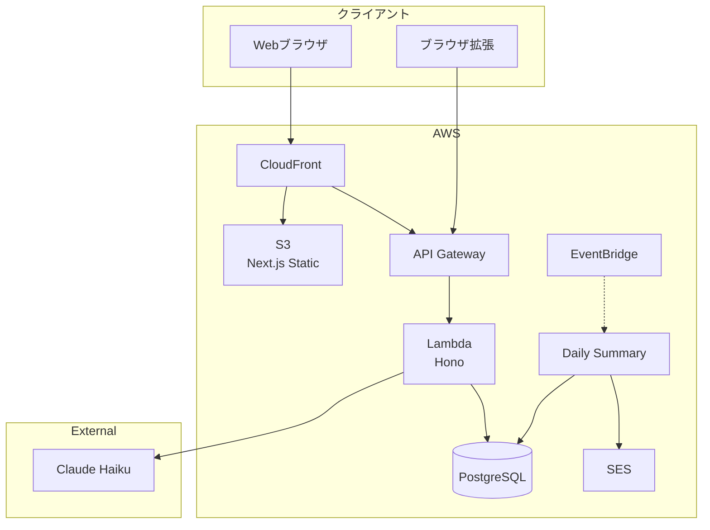
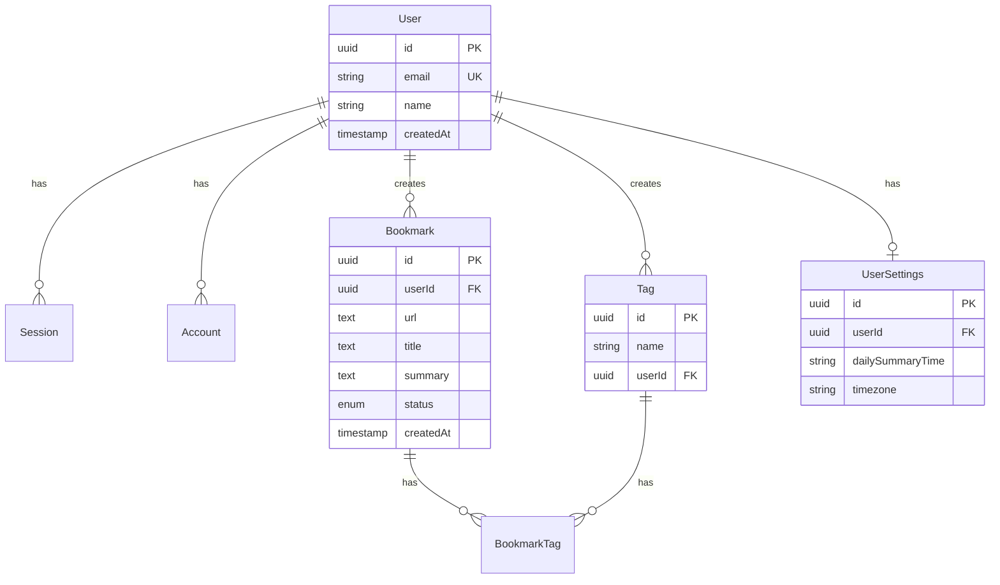

# 設計書

**アプリケーション名:** Remindrop

---

## 1. システムアーキテクチャ


```mermaid
graph TB
    subgraph "クライアント"
        Browser[Webブラウザ]
        Extension[ブラウザ拡張]
    end
    
    subgraph "AWS"
        CF[CloudFront] --> S3[S3<br/>Next.js Static]
        CF --> APIGW[API Gateway]
        APIGW --> Lambda[Lambda<br/>Hono]
        Lambda --> RDS[(PostgreSQL)]
        EB[EventBridge] -.-> DailyLambda[Daily Summary]
        DailyLambda --> SES[SES]
    end
    
    subgraph "External"
        Anthropic[Claude Haiku]
    end
    
    Browser --> CF
    Extension --> APIGW
    Lambda --> Anthropic
    DailyLambda --> RDS
```

### 技術スタック

| レイヤー | 技術 |
|---------|------|
| Frontend | Next.js 15, React 19, TailwindCSS, shadcn/ui, React Query, Orval |
| Backend | Hono, @hono/zod-openapi, Drizzle ORM, BetterAuth |
| Database | PostgreSQL (RDS db.t4g.micro) |
| AI | Anthropic Claude Haiku |
| Infra | AWS CDK, Lambda, S3, CloudFront, API Gateway, SES, EventBridge |

---

## 2. データベース設計

### ER図


```mermaid
erDiagram
    User ||--o{ Session : has
    User ||--o{ Account : has
    User ||--o{ Bookmark : creates
    User ||--o{ Tag : creates
    User ||--o| UserSettings : has
    Bookmark ||--o{ BookmarkTag : has
    Tag ||--o{ BookmarkTag : has

    User {
        uuid id PK
        string email UK
        string name
        timestamp createdAt
    }

    Bookmark {
        uuid id PK
        uuid userId FK
        text url
        text title
        text summary
        enum status
        timestamp createdAt
    }

    Tag {
        uuid id PK
        string name
        uuid userId FK
    }

    UserSettings {
        uuid id PK
        uuid userId FK
        string dailySummaryTime
        string timezone
    }
```

### 主要テーブル

| テーブル | 説明 | 主要カラム |
|---------|------|-----------|
| users | ユーザー（BetterAuth管理） | id, email, name |
| sessions | セッション（BetterAuth管理） | id, userId, token, expiresAt |
| accounts | OAuth連携（BetterAuth管理） | id, userId, providerId |
| bookmarks | ブックマーク | id, userId, url, title, summary, status |
| tags | タグ | id, userId, name |
| bookmark_tags | ブックマーク-タグ中間 | bookmarkId, tagId |
| user_settings | ユーザー設定 | userId, dailySummaryTime, timezone |

### 主要インデックス

- `bookmarks(userId, createdAt DESC)` - 一覧取得用
- `tags(userId, name)` - ユニーク制約

---

## 3. API設計

> **詳細仕様:** http://localhost:3001/api/docs (Scalar)

### エンドポイント一覧

| メソッド | パス | 説明 |
|---------|------|------|
| POST | /api/auth/sign-up | サインアップ |
| POST | /api/auth/sign-in/email | ログイン |
| POST | /api/auth/sign-out | ログアウト |
| GET | /api/auth/session | セッション確認 |
| GET | /api/bookmarks | ブックマーク一覧 |
| POST | /api/bookmarks | ブックマーク作成 |
| GET | /api/bookmarks/:id | ブックマーク詳細 |
| PATCH | /api/bookmarks/:id | ブックマーク更新 |
| DELETE | /api/bookmarks/:id | ブックマーク削除 |
| GET | /api/tags | タグ一覧 |
| GET | /api/settings | 設定取得 |
| PATCH | /api/settings | 設定更新 |

### ブックマーク一覧 クエリパラメータ

| パラメータ | 型 | 説明 |
|-----------|-----|------|
| page | number | ページ番号 (default: 1) |
| limit | number | 件数 (default: 20, max: 100) |
| search | string | 検索キーワード |
| fromDate | date | 開始日 (YYYY-MM-DD) |
| toDate | date | 終了日 (YYYY-MM-DD) |
| sort | string | ソート項目 (createdAt/updatedAt) |
| order | string | ソート順 (asc/desc) |

---

## 4. 処理フロー

### ブックマーク作成

1. ユーザーがURLを送信
2. APIがブックマークを作成（status: processing）
3. バックグラウンドでコンテンツ取得・AI要約・タグ生成
4. 完了後status更新（completed/failed）

### デイリーサマリー

1. EventBridge: 毎日21:00 JSTにトリガー
2. Lambda: 各ユーザーの今日のブックマークを取得
3. SES: サマリーメール送信

---

## 5. セキュリティ

| 項目 | 対策 |
|------|------|
| 認証 | BetterAuth (セッションベース、HttpOnly Cookie) |
| 認可 | 全APIで認証必須、リソース所有者チェック |
| 通信 | HTTPS (ACM証明書) |
| DB | VPC内、パブリックアクセス無効 |
| 入力検証 | Zod (@hono/zod-openapi) |
| 機密情報 | 環境変数 / Secrets Manager |

---

## 6. エラーハンドリング

### HTTPステータスコード

| コード | 用途 |
|-------|------|
| 200 | 成功 |
| 201 | 作成成功 |
| 204 | 削除成功 |
| 400 | リクエスト不正 |
| 401 | 認証エラー |
| 404 | リソース不在 |
| 500 | サーバーエラー |

### レスポンス形式

```json
{ "error": "エラーメッセージ" }
```

---

## 7. インフラ・運用

### 環境

| 環境 | 説明 |
|------|------|
| ローカル | Docker Compose (PostgreSQL) |
| AWS | CDKでデプロイ (Lambda, RDS, S3, CloudFront) |

### モニタリング

- CloudWatch Logs: Lambda/API ログ
- CloudWatch Metrics: 実行時間、エラー率
- CloudWatch Alarms: エラー率 > 5%, CPU > 80%

---

作成日: 2024-12-13
最終更新: 2025-01-12
